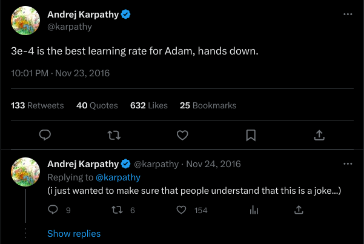
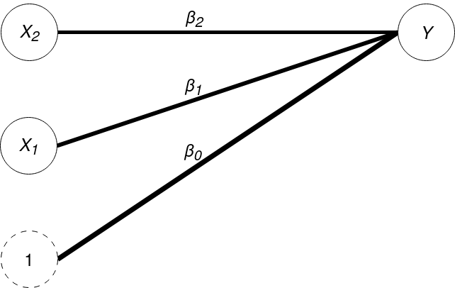
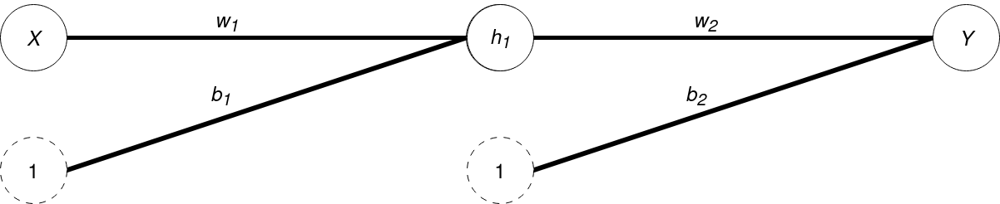
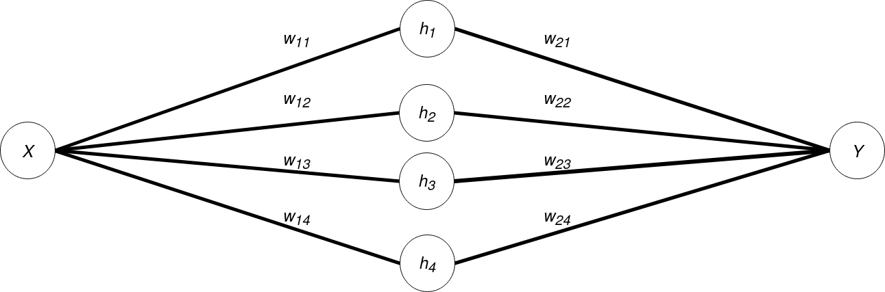
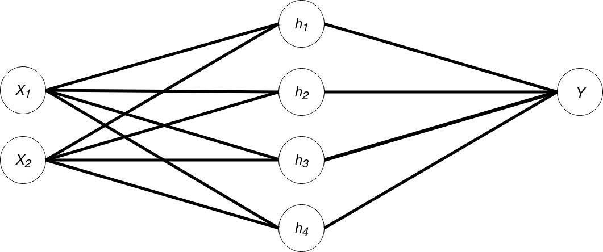
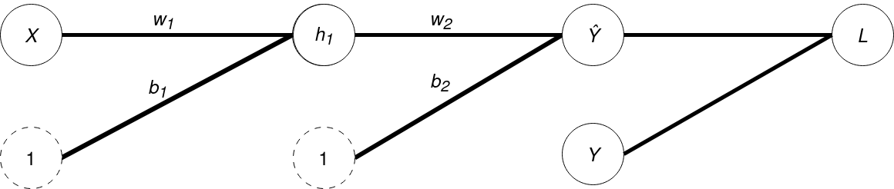

# Motivation

## Who is this for?

- Many social scientists use quantitative approaches to study complex questions.
- Familiarity with statistics, maybe also machine learning.
- But **deep learning** seems daunting.
- Aim is not to simplify subject, but to translate existing knowledge and expertise.

:::notes
- In short, me from a few years ago.
- Received training in quantitative methods, causal inference, some machine learning
- But deep learning always treated as a separate super-complicated thing
- Lots of resources for learning deep learning out there, but focus tends to be for (I assume) a CS audience.
- As quantitative social scientists, we're not seeking to avoid the math--on the contrary, we want to understand the tools and the resulting models. More on this in a bit.
:::

## What is Deep Learning?

- Approach to using computers to learn patterns in data
- based around a modular set of tools loosely inspired by biological neurons.
<!--- Basis of many advanced systems seen today.-->

::: notes
- "Machine learning" (it is in fact arguably a subfield)
:::

## Why learn about Deep Learning?

- **Opportunity**: _incredibly_ powerful tool for modelling complex processes
	- Image processing (Computer Vision)
	- Language (Natural Language Processing)
- **Engagement**: increasingly applied in social sciences
	- Extracting visual features [(Torres and Cantú 2021)](https://www.cambridge.org/core/journals/political-analysis/article/learning-to-see-convolutional-neural-networks-for-the-analysis-of-social-science-data/7417AE7F021C92CA32DC04D4D4282B90); Multiple imputation [(Lall and Robinson 2021)](https://www.cambridge.org/core/journals/political-analysis/article/midas-touch-accurate-and-scalable-missingdata-imputation-with-deep-learning/5007854F57E88AF16D69BCCA4C5AF1FF); Multilingual embeddings [(Licht 2023)](https://www.cambridge.org/core/journals/political-analysis/article/crosslingual-classification-of-political-texts-using-multilingual-sentence-embeddings/30689C8798F097EEBA514ABE4891A71B); Automated coding of videos [(Tarr, Hwang and Imai 2023)](https://www.cambridge.org/core/journals/political-analysis/article/automated-coding-of-political-campaign-advertisement-videos-an-empirical-validation-study/7B60C86AAC9E71016F9397D2FD247F8C)
- **Relevance**: Increasingly directly affecting society
	- [Potential Labor Market Impact of LLMs](https://arxiv.org/pdf/2303.10130.pdf)

::: notes
- 1st point is about research opportunities
- 2nd point is about need to engage with existing research
- 3rd point is about object of research
:::

## Why learn the fundamentals?

- Can get by with minimal understanding of "how" it works.
- But we're also interested in characterizing scope of claims, predictions.
- DL is about scaling; fundamentals scale.

## Learning Objectives

- The basic building block of neural networks: artificial neurons.
- How to learn from data with **optimization**.
- How and why "ensembling" neurons is powerful.

- _An "engineer's intuition" for modelling data._

## Format

- Lecture
- Supplementary Code Book: <ADD LINK HERE>
	- Contains same ideas as lecture
	- Implements these ideas in `PyTorch`

## tl;dr (Lecture in One Slide)

1. **Neural networks** are basically nested regression models with discontinuities.
2. **Backpropagation** is a technique that allows us to calculate the loss gradient of every parameter in a network.
3. **Loss gradients** link model parameters to the overall accuracy of the model.
4. **Gradient descent** is an algorithm for updating parameters using loss gradients to improve accuracy.
5. By "stacking" neurons and introducing discontinuities, we can learn complex patterns in data.

# Simple Case: One X, One Y

_We learn how to "manually" fit linear regressions._


## Problem

- We observe two processes, $y$ and $x$.
- We want to describe the _average linear_ relationship between them.
- Model: $y = \beta_1x + \beta_0$
- Parameters: $\beta_1$ and $\beta_0$ ← find optimal values for these
- In their language:
	- $\beta_1$ is $w$ (weight)
	- $\beta_0$ is $b$ (bias).

## Data (and OLS Solution)

<iframe width="100%" height="576px" frameborder="0" seamless='seamless' scrolling=no src="figures/figure1.html"></iframe>


## A General Procedure for Fitting Models

0. Begin with a random guess of the correct model.
1. Generate prediction using model and data.
2. Measure error.
3. Use this information to adjust the model.


## A Random Guess

<iframe width="100%" height="500px" frameborder="0" seamless='seamless' scrolling=no src="figures/figure2.html"></iframe>

- $w_{init} = 0.77$, $b_{init} = -0.15$

## Starting with a Single Data Point

- We can do this procedure with one, a few, or all data points.
- The difference is non-trivial, but the procedure is the same.
- Begin with single point for simplicity.
	- $(x, y) = (1.37, 3.91)$

## Generate Prediction

- Generate prediction:
	- $\hat{y} =  wx + b$
	- $x=1.37$
	- $0.91_{\hat{y}} \approx (0.77)_w\times(1.37)_x + (-0.15)_b$
- Called **Forward Pass**

## Computing Loss

- True $y$ is $3.91$.
	- Error: $y-\hat{y}=3.00$
- Loss function: $L(w, b)$
	- Expresses loss as function of $w$ and $b$
	- _Squared Error_: $L(w, b) = (y - \hat{y})^2$
- We need to square or take the absolute value.
- Why? Will become clear.

::: notes
- The operations we have are minimization or maximization of a score
- If we take error, then the minimum error is at negative infinity
- We want error to be _zero_, which is where loss is _minimized_.
:::


## How can we use this information?

- _Aim_: find values of $w$ and $b$ that make model as correct as possible.
	- Alternatively: find $w, b$ that minimize our error.
- We can use partial derivatives!
	- $\frac{\delta L(w, b)}{\delta w}$: describes how $L$ changes as we adjust $w$.
	- $\frac{\delta L(w, b)}{\delta b}$: describes how $L$ changes as we adjust $b$.

## Calculating the gradients

- Deep Learning libraries automate this step, but it's easy to do by hand!
- [Definition of a partial derivative](https://en.wikipedia.org/wiki/Partial_derivative#Definition):

. . .

$$
\frac{\delta f(x)}{\delta x} \;=\; \lim_{h \to 0} \frac{f(x+h)-f(x)}{h}
$$

## Calculating numerically

$$
\frac{\delta f(x)}{\delta x} \;=\; \lim_{h \to 0} \frac{f(x+h)-f(x)}{h}
$$

``` {.python .numberLines}
h = 0.0001                           # h as some arbitrarily small value
fx =  (y0 - (x0 *  w    + b)).pow(2) # f(x)   (squared loss)
fxh = (y0 - (x0 * (w+h) + b)).pow(2) # f(x+h)
dfx = (fxh-fx)/h                     # (f(x+h)-f(x))/h
```

- When $x, y = 1.37, 3.91$
- $\frac{\delta L}{\delta w} \approx -8.23$


## How do we use this gradient?

$-8.23$ tells us:

- when $x=1.37$
- if we increase $w$ by $1$
- our loss will _decrease_ at a rate of $8.23$
- So we should increase $w$.

## Visualizing the Gradient

<iframe width="100%" height="500px" frameborder="0" seamless='seamless' scrolling=no src="figures/figure3.html"></iframe>

::: notes

- Look at how loss changes as we vary $w$ first.
- Then show how that is reflected in the gradient.
- Make point about non-unique solution for two parameters with single data point

:::

## How much to adjust $w$?

- Why not change $w$ to minimize loss for each observation?

## Gradient Descent

$$
w' = w - \eta \frac{\delta L(w, b)}{\delta w}
$$

- $w$ is the current value of the parameter
- $\frac{\delta L}{\delta w}$ is the partial derivative of the loss function wrt the parameter.
- $w'$ is the new value of the parameter
- $\eta$ is the _Learning Rate_.

## How large is $\eta$?


- Usually some small value ($0.05$ or smaller).
- Hyperparameter and its optimal value is an empirical question.
- Meme value is [$3e-4$](https://twitter.com/karpathy/status/801621764144971776?lang=en)

. . .



## Our New Model

<iframe width="100%" height="500px" frameborder="0" seamless='seamless' scrolling=no src="figures/figure4.html"></iframe>

## Repeat for Full Dataset (One Epoch)

<iframe width="100%" height="500px" frameborder="0" seamless='seamless' scrolling=no src="figures/figure5.html"></iframe>

## Stochastic, Batch, Mini-Batch

- Stochastic: one observation at a time
- Batch: whole dataset at once
- Mini-batch: smaller-than-dataset batches
- For batch and mini-batch, we need a different loss function
	- _Mean Squared Loss_: $\frac{1}{N}\sum_i(y_i - \hat{y})^2$

## What did we just learn?

- ~~A slower and less precise method for linear regression.~~
- We can use the partial derivative of a loss function...
	- _the direction of decreasing loss_
- ... to adjust the parameters of a model...
	- _gradient descent updates_
- ... to fit it to our data.

# Two X, Binary Y

_Where linear regression won't cut it_.

## Challenging Shape

<iframe width="100%" height="500px" frameborder="0" seamless='seamless' scrolling=no src="figures/figure6.html"></iframe>

## Two Inputs



. . .

is the same as

. . .

$Y = \beta_2X_2 + \beta_1X_1 + \beta_0$

## Random Initialization

<iframe width="110%" height="500px" frameborder="0" seamless='seamless' scrolling=no src="figures/figure7.html"></iframe>

## Model After Training

<iframe width="100%" height="500px" frameborder="0" seamless='seamless' scrolling=no src="figures/figure8.html"></iframe>

## Doing Better

For this data, we want a model that can:

- Fit a more complicated response surface (than a straight line)
- Do classification instead of regression

## What if we started layering our models?



- $h_1 = w_{1}X + b_{1}$
- $Y = w_{2}h_1 + b_{2}$
- ergo $Y = w_{2}(w_{1}X + b_{1}) + b_{2}$

## And stacking it?



- $h_i = w_{1i}X + b_{1i}$ (bias omitted from diagram for simplicity)
- $Y = \sum_i w_{2i}h_i + b_{2i}$
- ergo $Y = \sum_i w_{2i}(w_{1i}X + b_{1i}) + b_{2i}$

## We could create a model like this:



## But how do we fit something like this?


- Define loss: $L(w_1, b_1, w_2, b_2)$
- How do we calculate $\frac{\delta L}{\delta w_1}$, $\frac{\delta L}{\delta w_2}$, etc.?

## Chains of equations



- $L = (y - \hat{y})^2$
	- $\frac{\delta L}{\delta \hat{y}} = 2(y-\hat{y})$
- $\hat{y} = w_{2}h_1 + b_{2}$
	- $\frac{\delta \hat{y}}{\delta w_2} = h_1$
	- $\frac{\delta \hat{y}}{\delta h_1} = w_2$
- $h_1 = w_{1}X + b_{1}$
	- $\frac{\delta h_1}{\delta w_1} = x$

## Chain Rule

Gradient for $w_1$:

\begin{align}
\frac{\delta L}{\delta w_1} &= \frac{\delta L}{\delta\hat{y}} \frac{\delta \hat{y}}{\delta w_2} \\
							&= 2(y-\hat{y}) h_1

\end{align}

. . .

Gradient for $w_2$:

\begin{align}
\frac{\delta L}{\delta w_1} &= \frac{\delta L}{\delta\hat{y}} \frac{\delta\hat{y}}{\delta h_1} \frac{\delta h_1}{\delta w_1} \\
							&= 2(y-\hat{y}) w_2 x

\end{align}

## Backpropagation

- Using the chain rule, we can efficiently compute loss gradients of parameters throughout the network!
- This is implemented neatly in deep learning libraries.

## Code vs Theory


``` {.python .numberLines}
# Define Model
layer1  = SimpleLinearNN(features_in=2, features_out=4)
layer2  = SimpleLinearNN(features_in=4, features_out=1)
model   = torch.nn.Sequential(layer1, layer2)
```

## Mini-Batch Gradient Descent with MSE Loss

``` {.python .numberLines}
# Define Batch Sampler, Loss Function and Optimization
data    = DataLoader(dataset, batch_size=8, shuffle=True)
loss_fn = torch.nn.MSELoss()
optim   = torch.optim.SGD(model.parameters(), lr=5e-4)
```

## Training a Model for 50 Epochs

``` {.python .numberLines}
for epoch in range(50):
    for inputs, labels in data: # X, y
        optim.zero_grad() # Reset gradients
        preds = model.forward(inputs) # Forward pass
        loss = loss_fn(preds, labels) # Loss calc
        loss.backward()   # Calculate gradients
        optim.step()      # Update parameters
```

## But: does it do better?

. . .

<iframe width="100%" height="500px" frameborder="0" seamless='seamless' scrolling=no src="figures/figure9.html"></iframe>

- Turns out: stacking/layering linear models reduces to a linear model!


## The Missing Ingredient

- Final missing ingredient is _non-linear activation functions_.
- You already know an example: logistic regression!

## Logistic regression?

Two components:

1. Linear model: $z = \beta_1x + \beta_0$
2. Sigmoid transformation: $y = \frac{1}{1+e^{-z}}$

## Sigmoid transformation

<iframe width="100%" height="400px" frameborder="0" seamless='seamless' scrolling=no src="figures/sigmoid.html"></iframe>

- $\sigma(x)$ bounded between 0 and 1
- When $x=0$, $\sigma(x)=0.5$.

## Artificial Neuron

- Logistic regression is an example of an artificial neuron, the basic building block of neural networks.
- Generally: activation function $\phi(\cdot)$ applied to weighted sum of inputs $\sum_i w_ix_i$:


. . .

$$
	y = \phi(\sum_i w_ix_i)
$$


## Neuron with Sigmoid Activation

<iframe width="100%" height="500px" frameborder="0" seamless='seamless' scrolling=no src="figures/figure10.html"></iframe>

- Flat decision boundary
- Predictions bounded between 0 and 1

## Deep Neural Network: 2-4-1

. . .

<iframe width="100%" height="500px" frameborder="0" seamless='seamless' scrolling=no src="figures/figure11.html"></iframe>

## Wider and Deeper Neural Network: 2-8-8-1

. . .

<iframe width="100%" height="500px" frameborder="0" seamless='seamless' scrolling=no src="figures/figure12.html"></iframe>

# Deep Learning Basics

_Now we're doing deep learning!_

## When to stop training?

Difficult question. A plausible strategy is:

- Leave some training data out for _evaluation_.
- Stop training when loss on data passes some threshold.

## 2-4-1 Network with Eval Loss <= 0.52

<iframe width="100%" height="500px" frameborder="0" seamless='seamless' scrolling=no src="figures/figure13.html"></iframe>

## More Complex Networks Generally Converge Faster

<iframe width="100%" height="500px" frameborder="0" seamless='seamless' scrolling=no src="figures/figure14.html"></iframe>

## Other Activation Functions


- Note technically, for backpropagation to work, partial derivative must be defined.

## ReLU Example

```{.python .numberLines}
model = nn.Sequential(Perceptron(2, 4, nn.ReLU),
                      Perceptron(4, 4, nn.ReLU),
                      Perceptron(4, 4, nn.ReLU),
                      Perceptron(4, 1, nn.Sigmoid))
```

. . .

<iframe width="100%" height="400px" frameborder="0" seamless='seamless' scrolling=no src="figures/figure15.html"></iframe>


# Recap

## Comprehension Check

1. **Neural networks** are basically nested regression models with discontinuities.
2. **Backpropagation** is a technique that allows us to calculate the loss gradient of every parameter in a network.
3. **Loss gradients** link model parameters to the overall accuracy of the model.
4. **Gradient descent** is an algorithm for updating parameters using loss gradients to improve accuracy.
5. By "stacking" neurons and introducing discontinuities, we can learn complex patterns in data.

## Next Time

- Scaling up further: modular architectures and mechanisms.
- "Pretraining" models: self-supervision and transfer learning.
- Generative models: autoregressive language generation.
- Architectures for sequences: recursive neural networks (RNNs), Transformers.

## Excellent Resources

- [playground.tensorflow.org](http://playground.tensorflow.org)
- [Backpropagation Calculus, Three Blue One Brown](https://www.youtube.com/watch?v=tIeHLnjs5U8)
- [Neural Networks from Scratch, Andrej Karpathy](https://www.youtube.com/watch?v=VMj-3S1tku0)


<!--docker run --rm --volume "`pwd`:/data" --user `id -u`:`id -g` pandoc/latex:2.18 -t revealjs --slide-level 2 -V theme=white --mathjax --citeproc -i -s -o presentation.html presentation.md --self-contained-->
