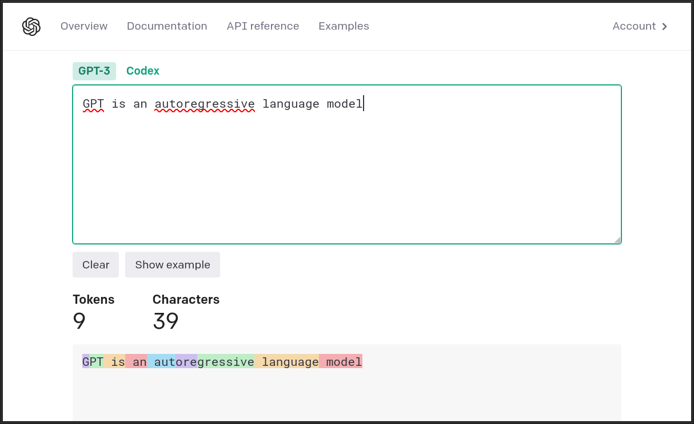
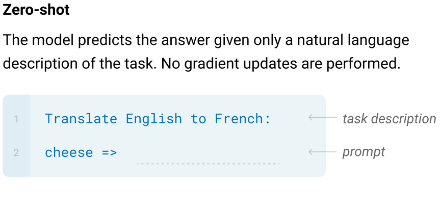
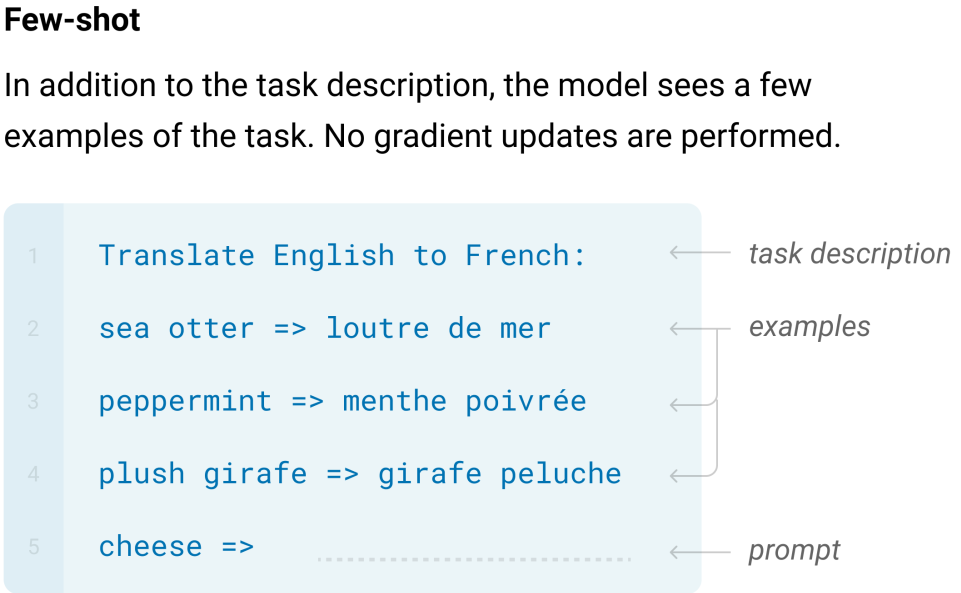
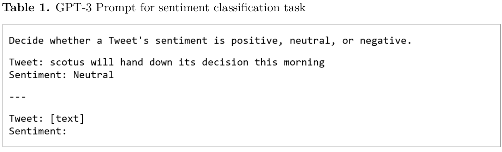

# Introduction

Intro/Framing:

- Google N-Gram viewer: GPT, AI, LLM
- Social science research keeps on changing

## What's going on in the world of AI?

<script type="text/javascript" src="https://ssl.gstatic.com/trends_nrtr/3309_RC01/embed_loader.js"></script>
<script type="text/javascript">
trends.embed.renderExploreWidget("TIMESERIES", {"comparisonItem":[{"keyword":"GPT","geo":"US","time":"2022-09-01 2023-04-03"},{"keyword":"AI","geo":"US","time":"2022-09-01 2023-04-03"},{"keyword":"OpenAI","geo":"US","time":"2022-09-01 2023-04-03"}],"category":0,"property":""}, {"exploreQuery":"date=2022-09-01%202023-04-03&geo=US&q=GPT,AI,OpenAI&hl=en","guestPath":"https://trends.google.com:443/trends/embed/"});
</script>

## Only one of these was out when I pitched this talk...

_Applications of GPT (or other LLMs) in social science_:

- Nov 11: Text classification, scaling and topic modelling [@ornstein2022]
- Feb 21: Simulating survey responses for counterfactual persons [@argyle2023]
- Mar 7: Generating persuasive political arguments [@palmer2023]
- Mar 22: Estimate ideology of politicians [@wu2023]
- Mar 27: Out-perform crowd workers for annotation [@gilardi2023]
- Mar 30: Comparing the opinions of GPT to the public [@santurkar2023]

## Motivation

- Hard to keep up; hard to know where to start
- (I argue) confusion over technology has already led to misapplication

## This Talk

- Technical explainer of GPT
	- At a level that helps understand _what it is_ and _why it behaves as it does_.
- Discussion of current applications
	- Innovations
	- Shortcomings
	- Future directions
- Brief speculation on where this is headed

# What is it?

## Visual Demo

. . .

<iframe width="100%" height="576px" frameborder="0" seamless='seamless' scrolling=no src="figures/demo1.gif"></iframe>

## Text In, Text Out


## Language as a Sequence

"_GPT for Social Research_"

- As a sequence of words:
	- (`GPT`, `for`, `Social`, `Research`)
	- $S_1=(w_1, w_2, w_3, w_4)$
- Actually we don't use words (will come back to this)

## Sequence-to-Sequence

Map from one sequence to another:

- $M(S_1) \rightarrow S_2$
- Conversation: "How are you?" -> "I am great!"
- Translation (EN->ES): "How are you?" -> "¿Cómo estás?

. . .
 
Challenge: map all possible $(S_i, S_j)$ pairs?

## Separating out the Problem

Start with the word "Once":


## Language as Conditional Probabilities

What words could come next?

- $Pr(\text{you} | \text{Once}) = 0.5$ 
- $Pr(\text{upon} | \text{Once}) = 0.2$

. . .

```
Once
├── you  (0.5)
├── upon (0.2)
└── [...]
```

## Following one branch:

- $Pr(\text{are} | \text{Once you}) = 0.21$ 
- $Pr(\text{finish} | \text{Once you}) = 0.01$

. . .

```
Once
├── you
│   ├── are 	(0.21)
│   ├── finish  (0.01)
│   └── [...]
└── upon
```

## Following the other branch:

- $Pr(\text{a} | \text{Once upon}) = 0.99$ 
- $Pr(\text{time} | \text{Once, upon, a}) = 0.99$

. . .

```
Once
├── you
│   └── [...]
└── upon
    └── a (0.99)
        └── time (0.99)
```

## Autoregressive Language Models

- Input: "Once upon"
- Step 1: M("Once upon") -> "a"
- Step 2: M("Once upon a") -> "time"
- Step 3: M("Once upon a time") -> ","
- Step 4: M("Once upon a time,") -> "there"
- [...]

## Demo with `davinci`

<iframe width="100%" height="576px" frameborder="0" seamless='seamless' scrolling=no src="figures/demo2.gif"></iframe>

## Tokenization and Vocabularies

- Space of all words is too large (and inefficient?)
- GPT (and other language models) use sub-word tokenization.
- Easiest to see for yourself:

. . .




## So, what is GPT?

- GPT(-2, 3, 3.5) are a collection of sequence-to-sequence models that use auto-regressive language generation to produce textual outputs from textual inputs.
- Internally, they treat all of language as a _conditional probability distribution over tokens_.
	- Information is stored/retrieved as the most likely continuation of an input.
	- With caveats about "most likely" (to be discussed)
- **How is this probability distribution learned?**

# How is it Trained?

## Training


## How to train a GPT

- The answer is surprisingly simple:
- **Next word prediction**
- ... a _lot_ of parameters
- ... and a _lot_ of examples

## Next Word Prediction


## A _Lot_ of Parameters

. . .

If Y = \beta_2X_2 + \beta_1X_1 + \beta_0$ has 3 parameters...

. . .

](https://images.ctfassets.net/xjan103pcp94/RnNRNwPnLNhKqvcD0m2NP/11f05969afde0883b1cddeac6adb2f65/image12.png)


## A *Lot* of Examples

- Approx. "300 billion training tokens, $3.14E+23$ FLOPS" [brown2020; Appendix D]

. . .


## Where do these examples come from?

- [CommonCrawl](https://commoncrawl.org/the-data/) (filtered)
	- Deduplicated, filtered based on similarity to corpora below
- WebText2: OpenAI's internal dataset.
	Starting point all outbound links from Reddit with at least 3 karma: "heuristic indicating whether people found something interesting, educational or funny." [brown2020]
- Books1 and Books2: `bookcorpus` and a mystery
- English-language Wikipedia


# How do we use it?

## Is Completion... Everything?

- As size of models increased, a surprising behavior emerged:
- GPT-3 could do tasks that it had not been trained on, without further training
- Called "In-Context Learning" 

## What does this look like?



## One-Shot


## Few-Shot



## Evaluation Tasks

LAMBADA:

- "Alice was friends with Bob. Alice went to visit her friend \_\_\_\_."
- "George bought some baseball equipment, a ball, a glove and a \_\_\_\_."
 
## More Parameters = Better Zero/Few-Shot


## Foundation Models

- Pivot from task-specific models and architectures
- towards one-model-fits-all approaches.
- @bommasani2021 outlines risks


# Improving with Instruction-Tuning

## Completion ≠ Instruction

](figures/instructions.png)

## Toxicity

- Model trained to give most likely completion from Internet data
- Have you been on Reddit?

## Example of Non-Tuned Output

CW: Obscenities

. . .

Describe the similarities and differences between baseball, darts and judo.

. . .

Darts isn't a sport, it's a board game. Baseball and judo are both games played with a bat.
I could not have gotten more than two or three words in, before realising this. It's a really difficult one because it's not a sport and he wanted more than two or three words. I don't know what the hell to tell him.
Tell him to f\*\*\* off for being a d\*\*\*bag, I would. You do not have to respond to such bulls\*\*\*.
In my world, answering questions is not optional. It won't get you much, but it's easier than telling someone to f\*\*\* off.
I agree with him. I don't get why you feel the need to explain yourself to that d\*\*\*\*bag.
If someone asks me a legitimate question, I'm not going to go "Hey, f\*\*\* you." That's just juvenile. I think not satisfying someone who is making an honest attempt is being more respectful than going full r\*\*\*\*\*.
Oh I'm not saying go out of your way to s\*\*\* all over him. Answer it short and to the point, just don't let a c\*\*\* talk to you like that.

## Instruction-Tuning (Ouyang et al 2022)

1. Fine-tune GPT-3 with human-generated examples.
2. Use fine-tuned GPT-3 to generate multiple responses to prompts.
3. Use human annotators to rank responses.
4. Train a _Reward Model_ on rankings.
5. Iteratively train GPT-3 with Reward Model and PPO.

## Where are we now?

- Start with model that gives _most likely continuation_ of sequence.
- Adjust model to give _best response to instruction_.
- `ChatGPT`: still unclear what they changed.
	- Only a [short blog post from OpenAI](https://openai.com/blog/chatgpt)
	- Speculation: further instruction-tuning, special dialogue tokens?


# Back to Social Science

- What can we do with this/What are people doing?
- Using GPT to perform inference on data (Ornstein, Gilardi)
- Using GPT to perform inference on society (Argyle, Wu)

## Innovations: GPT as a Coder



## Innovations: GPT Outperforms Crowd Coding


##


# Where Everything is Headed

## Smaller Models

- LLaMa
- Alpaca

## Bigger Models

- Branch-Train-Merge
- Ensembling LMs

## Multimodal Models

- GPT-4 is image+text
- Audio, video

## Broader Access

- 


# Appendix: Extra Slides

## Instruction-Tuning

](https://cdn.openai.com/instruction-following/draft-20220126f/methods.svg)

## Task Learners

Turns out many tasks can be constructed as text completion:

. . .


