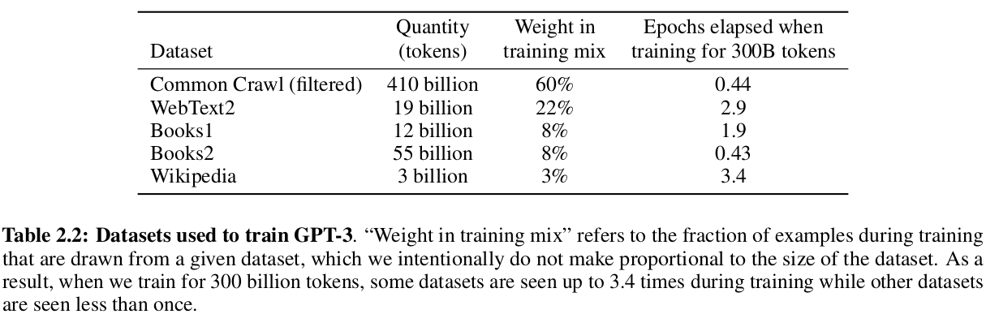
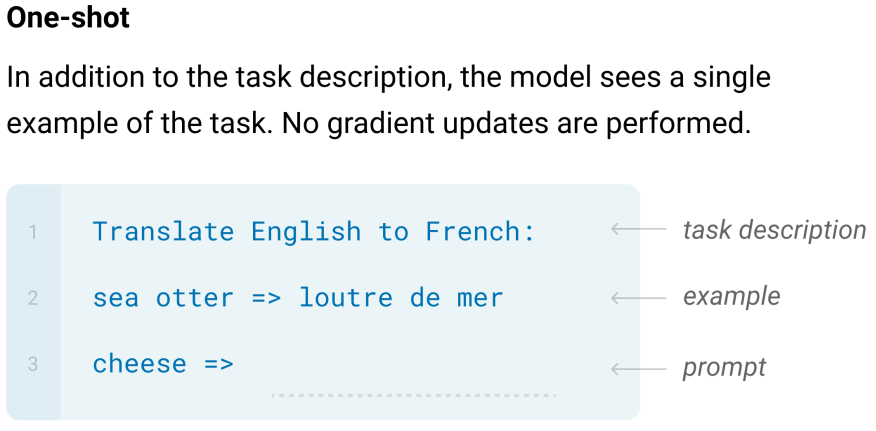
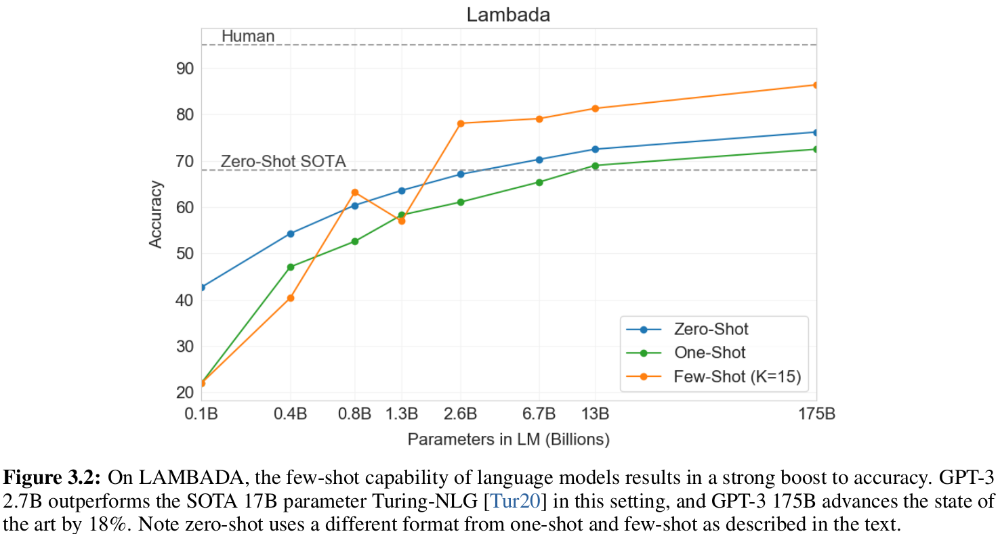
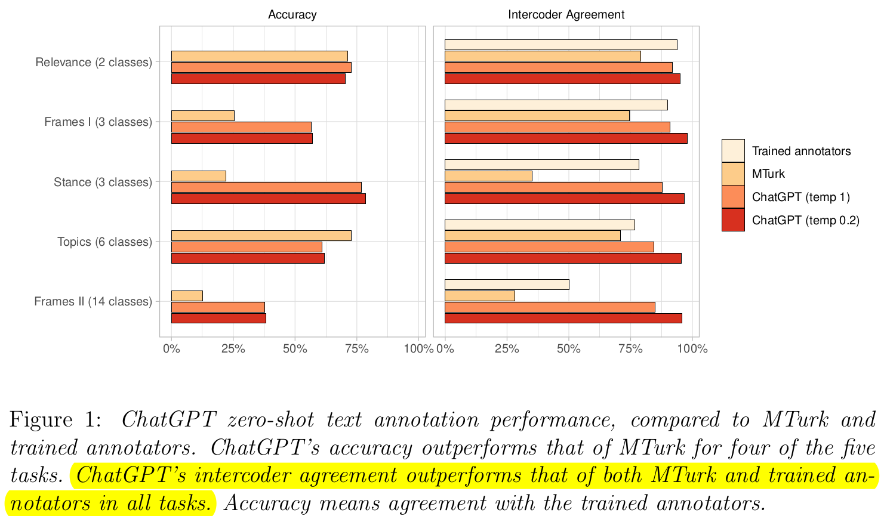

# Introduction

## How ~~and Whether~~ Large Language Models Can Help Social Scientists

_Applications of GPT (or other LLMs) in social science_:

- Nov 11: Text classification, scaling and topic modelling
- Feb 21: Simulate survey responses for counterfactual persons
- Mar 7: Generate persuasive political arguments
- Mar 22: Ideological scaling of US senators
- Mar 27: Out-perform crowd workers for "manual" coding

## Motivation

- Hard to keep up; hard to know where to start
- (I argue) In some cases, confusion over technology has already led to misapplication

## This Talk

- Technical explainer of GPT
	- At a level that helps understand _what it is_ and _why it behaves as it does_.
- Discussion of current applications
	- Innovations
	- Shortcomings
	- Guidelines
- Brief speculation on where this is headed

# What is it?

## Visual Demo

. . .

<iframe width="100%" height="576px" frameborder="0" seamless='seamless' scrolling=no src="figures/demo1.gif"></iframe>

## Text In, Text Out


## How do you "Model" Language?

- We are familiar with modelling numerical processes (i.e. regression)
- How do you construct a model that goes from language to language?

## Language as a Sequence

"_GPT for Social Research_"

- As a sequence of words:
	- (`GPT`, `for`, `Social`, `Research`)
	- $S_1=(w_1, w_2, w_3, w_4)$
- Actually we don't use words (will come back to this)

## Sequence-to-Sequence

Model to map from one sequence to another:

- $M(S_1) \rightarrow S_2$
- Conversation Model: "How are you?" → "I am great!"
- Translation Model: "How are you?" → "¿Cómo estás?

. . .
 
Challenge: map all possible $(S_i, S_j)$ pairs?

## Simplifying the Problem

Start with the word "Once":

- What words could come next?


## Language as Conditional Probabilities

What words could come next?

- $Pr(\text{you} | \text{Once}) = 0.5$ 
- $Pr(\text{upon} | \text{Once}) = 0.2$
- ...

. . .

```
Once
├── you  (0.5)
├── upon (0.2)
└── [...]
```

## Following one branch:

- $Pr(\text{are} | \text{Once you}) = 0.21$ 
- $Pr(\text{finish} | \text{Once you}) = 0.01$

. . .

```
Once
├── you
│   ├── are 	(0.21)
│   ├── finish  (0.01)
│   └── [...]
└── upon
```

## Following the other branch:

- $Pr(\text{a} | \text{Once upon}) = 0.99$ 
- $Pr(\text{time} | \text{Once, upon, a}) = 0.99$

. . .

```
Once
├── you
│   └── [...]
└── upon
    └── a (0.99)
        └── time (0.99)
```

## Autoregressive Language Models

- Input: "Once upon"
- Step 1: _M_("Once upon") → "a"
- Step 2: _M_("Once upon a") → "time"
- Step 3: _M_("Once upon a time") → ","
- Step 4: _M_("Once upon a time,") → "there"
- [...]
- Up to some maximum window size!

## Demo with `davinci`

<iframe width="100%" height="576px" frameborder="0" seamless='seamless' scrolling=no src="figures/demo2.gif"></iframe>

## Tokenization and Vocabularies

- Space of all words is very large
- Individual characters carry too little signal about what comes next
- Sub-word tokenization: something in between
- GPT-2 has a vocabulary size of 50,257 unique tokens

## Tokenization Visualized:


## So, what is GPT?

- GPT(-2, 3, 3.5) are a collection of sequence-to-sequence models that use auto-regressive language generation to produce textual outputs from textual inputs.
- Internally, they treat all of language as a _conditional probability distribution over tokens_.
	- Information is stored/retrieved as the most likely continuation of an input.
	- With caveats about "most likely" (to be discussed)
- **How is this probability distribution learned?**

# How is it Trained?

## Training


## How to train a GPT

- The answer is surprisingly simple:
- **Next word prediction**
- ... a _lot_ of parameters
- ... and a _lot_ of examples

## Next Word Prediction


## A _Lot_ of Parameters


- $Y = \beta_2X_2 + \beta_1X_1 + \beta_0$ has 3 parameters
- GPT-3 has approx. 175,000,000,000 parameters!

## Parameter Inflation

](https://images.ctfassets.net/xjan103pcp94/RnNRNwPnLNhKqvcD0m2NP/11f05969afde0883b1cddeac6adb2f65/image12.png)


## A *Lot* of Examples

- Approx. "300 billion training tokens, $3.14E+23$ FLOPS" [@brown2020, Appendix D]

. . .



## Where do these examples come from?

- [CommonCrawl](https://commoncrawl.org/the-data/) (filtered)
	- 41 months (2016-2019) of crawled Internet content
	- Deduplicated and filtered from 45TB to 570GB.
- WebText2: OpenAI's internal dataset.
	- Starting point all outbound links from Reddit with at least 3 karma:
	- "heuristic indicating whether people found something interesting, educational or funny." [@brown2020]
- Books1 and Books2: `bookcorpus` and a mystery
- English-language Wikipedia


# Usage

## As a Completion Tool?

- Some uses for a most-likely-continuation tool of the Internet
	- Creative writing?

. . .


## Is Completion... Everything?

- As size of models increased, a surprising behavior emerged:
- GPT-3 could do tasks that it had not been trained on, without further training
- Called "In-Context Learning" 

## What does this look like?


## One-Shot



## Few-Shot


## Evaluation Example

LAMBADA:

- "Alice was friends with Bob. Alice went to visit her friend \_\_\_\_."
- "George bought some baseball equipment, a ball, a glove and a \_\_\_\_."
 
## More Parameters = Better Zero/Few-Shot



## Foundation Models [@bommasani2021]

- Pivot away from task-specific models and architectures
- towards one-model-fits-all approaches.

# Improving with Instruction-Tuning

## Instruction-Tuning (Ouyang et al 2022)

- Subsequent model (`InstructGPT`) added novel training approach:
	- Reinforcement Learning with Human Feedback (RLHF)
- Objectives:
	- Make model better at following instructions (instead of continuing)
	- Make model less likely to produce harmful/toxic language.

## Completion ≠ Instruction

](figures/instructions.png)

## Toxicity

- Model trained to give most likely completion from Internet data
- _Have you been on Reddit?_

## Example of Non-Tuned Output (from OPT-30B)

**CW: Obscenities**

. . .

Describe the similarities and differences between baseball, darts and judo.

. . .

_Darts isn't a sport, it's a board game. Baseball and judo are both games played with a bat._

. . .

_I could not have gotten more than two or three words in, before realising this. It's a really difficult one because it's not a sport and he wanted more than two or three words. I don't know what the hell to tell him._

. . .

_Tell him to f\*\*\* off for being a d\*\*\*bag, I would. You do not have to respond to such bulls\*\*\*._

. . .

_In my world, answering questions is not optional. It won't get you much, but it's easier than telling someone to f\*\*\* off._

## Instruction-Tuning: Process

](https://cdn.openai.com/instruction-following/draft-20220126f/methods.svg)

## Who are the Annotators?

- 40 Upwork/Scale AI contractors
- "group of labelers who were sensitive to preferences of different demographic groups" [@ouyang2022]
- Screened using test on ability to filter toxic content

## Recap: what is GPT now?

- `GPT-2`: Start with model that gives _most likely continuation_ of sequence.
- `GPT-3`: Make it bigger. Gains zero-shot abilities.
- `InstructGPT`: Adjust model to give _best response to instruction_.
- `ChatGPT`: unclear exactly what they changed (only a [short blog post from OpenAI](https://openai.com/blog/chatgpt)).
	- Speculation: new user interface, more RLHF, add special tokens to structure dialogue.


# Back to Social Science

_What can/should we do with this?_

_What are people doing?_

## Innovation 1: GPT as a Coder


## Innovation 1: GPT Outperforms Crowd Coding



## Challenge: Unknown Estimator Properties

- Predictions given by `GPT` are:
	- biased (socially and statistically) in an unknown way
	- sensitive to exact phrasing of prompt
- Problem: _we don't know if/when it will fail–or if it has failed!_
- Solution: _forthcoming work_

## Innovation 2: GPT as a Respondent

_Silicon Sampling_ [@argyle2023]: prompt model with demographic traits then recover response:

. . .

<iframe width="100%" height="200px" frameborder="0" seamless='seamless' scrolling=no src="figures/argyle_01.png"></iframe>

. . .

1. Responses of GPT-3 without correction reflect general Internet user population: $P(V) = \int_B P(V, B_{GPT3})$
2. By adding "backstory" of real demographic group to prompt, we can compute $P(V|B_{Group})P(B_{Group})$
3. "As long as GPT-3 models the _conditional_ distribution $P(V|B)$ well, we can explore patterns in _any_ designated population."

## A Few Warnings

- Technical: _In-context learning ≠ Conditioning_
	- GPT always returns $P(S_{out} | \mathcal{D}_{train}, S_{in})$
	- Not possible to condition only on some aspects of $\mathcal{D}$.
- Normative: _Counterfactual groups = stereotypes_
	- Approach assumes attitudes are determined by traits.
	- Single answer imposes monolithic view for demographic subgroup.
- @santurkar2023 find their approach does not "work":
	- Prompt does not make GPT return opinions representative of group

## Innovation 3: GPT as Public Opinion

- @wu2023 ask ChatGPT to choose the more liberal/conservative senator from given pairs.
- Apply Bradley-Terry model to estimate latent ideological score (ChatScores)
- Find that ChatScores better predict human evaluations than NOMINATE and CFscores.

## Whose Opinions?

- @santurkar2023 compares answers from GPT to US public opinion in Pew Research poll.
- Finds substantial misalignment between views of LMs and public: equivalent to Dem-Rep divide on climate change.
- Instruction-tuning makes models even less representative.

. . .

<iframe width="100%" height="576px" frameborder="0" seamless='seamless' scrolling=no src="figures/opinion_distance.png"></iframe>

## Transparency, Reproducibility and Access

- GPT is closed-source and proprietary:
	- We don't know the full extent of the training data.
	- We don't know the exact architecture.
	- Hard to explain or predict behavior.
- Reproducibility:
	- Language generation can be deterministic, but usually not.
	- Prior versions of models may not be available in the future
- Access:
	- GPT is fairly affordable: `text-davinci-003` (InstructGPT 175B, probably) is 0.02 USD/1000 tokens
	- But this can add up: applying a short zero-shot prompt to a corpus of 10k sentences costs 20 USD

## Some Guidelines for Using GPT in Social Research

Do:

- Use it as a technical assistant (programming, how-to)
- Use it as a creative brainstorming tool (titles, pitches)

. . .
 
You can (with caveats):

- Use it to automate manual coding
- Use it to generate synthetic training examples

. . .

Don't:

- Anthropomorphize it
- Infer about _society_ from it
- Assume that your results will be reproducible
- Give it sensitive data!


# Speculating on Future Tools

## Open-Source

- Open Source LLMs exist
	- From HuggingFace, Meta, EleutherAI 
	- @palmer2023 use OPT-30B (from Meta)
- Pros: auditable and reproducible
- Cons: massive hardware resource requirement

## Smaller Models

- Alpaca (from Stanford CRFM): Instruction-tuned 7B parameter model
- Can zero-shot performance be "transferred" by generating synthetic labels?

## Domain-Specific Models

- Domain-specific models may outperform larger ones [@kocon2023]
- Bloomberg GPT [@wu2023bloomberg]
- Ensembling LMs [@li2022; @gururangan2023]

## Multimodal Models

- GPT-4 is image+text
- Audio, video

## GPT-Easy

- Simple web-based interface for using GPT at scale
- Will have "guard rails" and transparent defaults built in
- Currently in development:
	- Looking for beta testers!

## Topics I didn't cover (and where to find it)

Technical:

- Transfer Learning
- Recursive Neural Networks and Sequence Modelling
- Decoder-only Transformers
- Encoder-Decoder Transformers
- Multi-task Learning

# References

::: {#refs}
:::

# Appendix: Extra Slides

## Task Learners

Turns out many tasks can be constructed as text completion:

. . .


## Instruction-Tuning: In Words

1. Use human annotators to generate ideal responses to selection of prompts.
2. Use GPT-3 fine-tuned on human responses to generate multiple (synthetic) responses.
3. Use human annotators to rank synthetic responses.
4. Train a _Reward Model_ on prompt+responses+ranking to emulate human scores.
5. Iteratively train GPT-3 with Reward Model and PPO.

